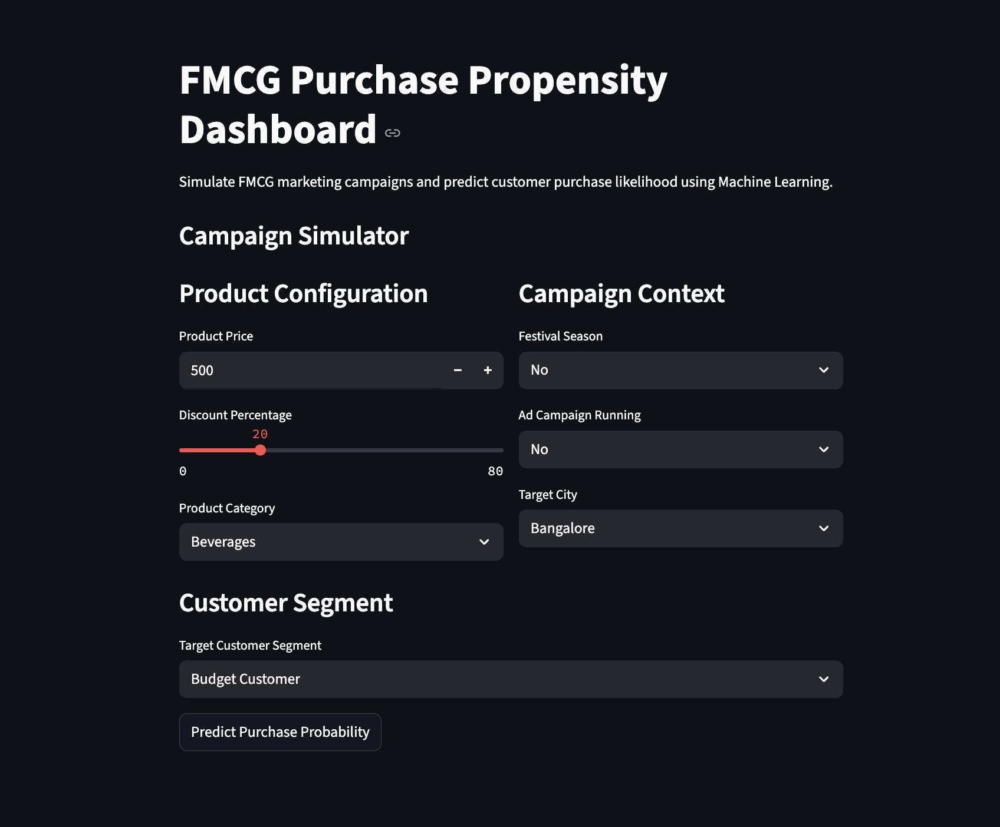

<div align="center">

# FMCG Purchase Propensity Prediction Dashboard

<br>


</div>



# Project Overview

An end-to-end Machine Learning project focused on understanding customer purchase behavior in the FMCG (Fast-Moving Consumer Goods) domain using classification models, campaign simulation, and business-driven ML system design.

This project started as a simple classification problem:

> Predict whether a customer will buy a specific FMCG product or not.

Initially, the focus was heavily model-centric:
- data preprocessing
- encoding
- feature engineering
- model training
- accuracy optimization

However, during development, a much more important realization happened:

> Building a Machine Learning model is not the same as building a real-world business system.

This project gradually evolved from:

```text
Train model → Get predictions
```

into:

```text
Understand business problem → Design inference workflow → Build ML system
```

That transition became the most valuable outcome of this project.

---

# Tech Stack

- Python
- Pandas
- NumPy
- Scikit-learn
- XGBoost
- Streamlit
- Joblib

---

# Features

- FMCG campaign simulation dashboard
- Purchase propensity prediction
- Customer segment simulation
- Probability-based prediction system
- Feature engineering pipeline
- Model preprocessing pipeline
- Streamlit interactive UI

---

# The Biggest Mistake We Initially Made

At the beginning of the project, the focus was completely on solving the Machine Learning problem.

We immediately started:
- cleaning data
- encoding categorical variables
- training models
- checking accuracy
- optimizing metrics

without first understanding:

```text
What is the actual business problem?
```

This turned out to be the biggest mistake.

---

# The Real Problem We Should Have Solved First

We never thought about:
- what the user input should actually be
- what the FMCG company really needs
- what features should come from the company
- what features should come from customer history
- whether all model features are realistically obtainable during deployment

Instead, we directly started solving the ML problem.

The correct approach should have been:

```text
Understand the business workflow first
→ then design the ML pipeline
→ then train the model
```

---

# Important Realization

Before building any ML system, we should first ask:

- What is the final output?
- What decision is the business trying to make?
- What inputs will the user provide?
- Which features are actually available during deployment?
- Which features should come from backend systems or databases?
- Are we unnecessarily asking the user for too much information?

This project helped us understand that:

> A Machine Learning model is only one small part of a much larger business system.

---

# What We Would Do Differently If Starting Again

If this project were rebuilt from scratch, the approach would be very different.

The first step would be:

## 1. Build Customer Behavioral Dataset

Collect historical customer data such as:
- previous purchases
- average spending
- loyalty behavior
- membership history
- purchase frequency

This customer database would become the behavioral foundation of the model.

---

## 2. Separate Company Features From Customer Features

### Company-Controlled Features
These are the inputs that the FMCG company can control:

- Product Price
- Discount Percentage
- Festival Season
- Product Category
- Product Name
- Campaign Information
- Region / City

### Customer Features
These come from existing customer history:

- Brand Loyalty
- Previous Purchases
- Spending Patterns
- Membership Levels
- Customer Segments

This separation is extremely important in real-world ML systems.

---

# What The Frontend Should Actually Ask

Initially, the dashboard asked for many unnecessary inputs.

However, in a real-world FMCG system:

> The frontend should mainly collect company-side information.

Meaning:
- product details
- discounts
- campaign information
- pricing
- seasonal details

The customer-side data should already exist inside the company's backend systems or databases.

---

# Correct Enterprise-Style Workflow

The correct architecture should look like this:

```text
Company Inputs
        +
Customer Database
        ↓
Feature Combination
        ↓
Model Prediction
        ↓
Demand Forecasting
```

---

# How The Prediction System Actually Works

A very important realization from this project was understanding:

> The model does NOT magically use all customers at once.

Instead:

- Company product data remains static
- Customer data changes row-by-row
- The model predicts for every customer separately
- All predictions are then aggregated together

---

# Final Prediction Architecture

## Step 1 — Keep Product/Campaign Data Static

The FMCG company enters:

- product price
- discount
- product category
- festival season
- campaign details

These values remain constant.

---

## Step 2 — Iterate Through Customer Database

Each customer row contains:

- spending behavior
- loyalty score
- previous purchases
- membership level

The product information remains the same while customer features keep changing.

---

## Step 3 — Predict Purchase Probability For Every Customer

The classifier predicts:

```text
Will this customer buy this product under these conditions?
```

using:

```python
predict_proba()
```

This gives a probability score instead of just yes/no.

Example:

| Customer | Buy Probability |
|----------|------------------|
| A        | 0.92             |
| B        | 0.61             |
| C        | 0.15             |

---

# Important Learning About Probabilities

Initially, the assumption was:

```text
predict() → final answer
```

But probabilities are far more useful in enterprise systems.

Instead of only using:

```python
model.predict()
```

real systems often use:

```python
model.predict_proba()
```

because probabilities preserve uncertainty.

---

# How Expected Buyers Are Calculated

All customer probabilities are added together:

```text
Expected Buyers = Sum of Probabilities
```

Example:

```text
0.92 + 0.61 + 0.15 = 1.68 expected buyers
```

This does NOT mean 168%.

It means:

```text
Expected ~1.68 customers likely to buy
```

To get conversion percentage:

```text
Expected Buyers / Total Customers
```

---

# Quantity Prediction (Regression Model)

Another important realization was:

> Predicting purchase quantity is a completely different ML problem.

Classification answers:

```text
Will the customer buy?
```

But regression answers:

```text
How much quantity will they buy?
```

---

# Correct Industry-Style Pipeline

## Model 1 — Classification

Predict:
```text
Will Buy?
```

using:
- XGBoost Classifier
- Logistic Regression
- Random Forest

---

## Model 2 — Regression

Only for predicted buyers:

Predict:
```text
Expected Quantity
```

using regression models such as:
- Linear Regression
- Random Forest Regressor
- XGBoost Regressor

---

# Final Demand Forecasting Logic

For every customer:

```text
Buy Probability × Expected Quantity
```

Then:

```text
Sum across all customers
```

This gives:

- expected sales volume
- expected inventory demand
- campaign effectiveness

---

# Biggest Final Learning

This project taught one major lesson:

```text
Machine Learning projects are NOT just prediction projects.
```

They are:

```text
Decision-making systems built around data.
```

The actual challenge is not only training the model.

The real challenge is:

- understanding the business problem
- designing the data flow
- collecting meaningful features
- designing inference pipelines
- building realistic deployment systems

---

# Current Status

Current implementation includes:
- Streamlit Dashboard
- XGBoost Classifier
- Customer Segment Simulation
- Purchase Probability Prediction
- Full preprocessing pipeline
- Feature engineering workflow

---

# Final Thought

This project became valuable not because it achieved high accuracy.

It became valuable because it changed the way the problem itself was understood.

The biggest learning was:

```text
Do not start by solving the model.
Start by understanding the business system.
```
